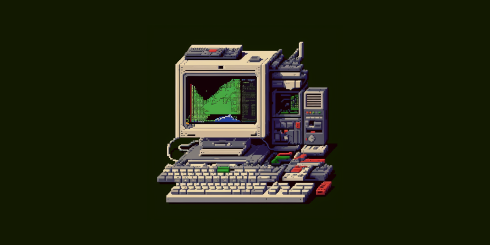

# Licenciatura em Engenharia de Computadores e Informática

# Conteúdos

## 1º Ano

### 1º Semestre

- Álgebra Linear e Geometria Analítica - Não disponível
- [Cálculo I](./ano_1_semestre_1/calculo_1) - Atualizado em 2022/2023
- [Fundamentos de Programação](./ano_1_semestre_1/fundamentos_de_programacao) - Atualizado em 2021/2022
- [Introdução à Engenharia Informática](./ano_1_semestre_1/introducao_a_engenharia_informatica) - Atualizado em 2021/2022
- Introdução aos Sistemas Digitais - Não disponível

### 2º Semestre

- [Cálculo II](./ano_1_semestre_2/calculo_2) - Atualizado em 2021/2022
- [Laboratorio de Sistema Digitais](./ano_1_semestre_2/laboratorio_de_sistemas_digitais) - Atualizado em 2021/2022
- [Laboratórios de Informática](./ano_1_semestre_2/laboratorios_de_informatica) - Atualizado em 2021/2022
- Matemática Discreta - Não disponível
- [Programação Orientada a Objetos](./ano_1_semestre_2/programacao_orientada_a_objetos) - Atualizado em 2021/2022

## 2º Ano

### 1º Semestre

- [Algoritmos e Estruturas de Dados](./ano_2_semestre_1/algoritmos_e_estruturas_de_dados) - Atualizado em 2022/2023
- [Arquitetura de Computadores I](./ano_2_semestre_1/arquitetura_de_computadores_1) - Atualizado em 2022/2023
- Competências Transferíveis I
    - [Design Thinking](./ano_2_semestre_1/design_thinking) - Atualizado em 2022/2023
    - Economia I - Não disponível
    - [Empreendedorismo e Novos Negócios](./ano_2_semestre_1/empreendedorismo_e_novos_negocios) - Atualizado em 2022/2023
    - Finanças Empresariais - Não disponível
    - [Gestão de Projetos](./ano_2_semestre_1/gestao_de_projetos) - Atualizado em 2022/2023
    - Técnicas de Comunicação e Apresentações - Não disponível
- [Mecânica e Campo Eletromagnético](./ano_2_semestre_1/mecanica_e_campo_eletromagnetico) - Atualizado em 2022/2023
- [Redes de Comunicações I](./ano_2_semestre_1/redes_de_comunicacoes_1) - Atualizado em 2022/2023

### 2º Semestre

- [Análise de Sistemas](./ano_2_semestre_2/analise_de_sistemas) - Atualizado em 2022/2023
- [Arquitetura de Computadores II](./ano_2_semestre_2/arquitetura_de_computadores_2) - Atualizado em 2022/2023
- Competências Transferíveis II
    - [Energias Renováveis](./ano_2_semestre_2/energias_renovaveis) - Atualizado em 2022/2023
    - Fabrico Aditivo e Impressão 3D - Não disponível
    - Interação Humano-Computador - Não disponível
    - Introdução ao Método dos Elementos Finitos - Não disponível
    - Investigação Operacional - Não disponível
    - Materiais e Desenvolvimento Sustentável - Não disponível
    - [Microcontroladores e Interação com Sensores e Atuadores](./ano_2_semestre_2/microcontrololadores_e_interacao_com_sensores_e_atuadores) - Atualizado em 2022/2023
    - Mobilidade Sustentável - Não disponível
    - [Programação Web](./ano_2_semestre_2/programacao_web) - Atualizado em 2022/2023
    - Visualização de Dados - Não disponível
- [Redes de Comunicações II](./ano_2_semestre_2/redes_de_comunicacoes_2) - Atualizado em 2022/2023
- [Sinais e Sistemas Eletrónicos](./ano_2_semestre_2/sinais_e_sistemas_eletronicos) - Atualizado em 2022/2023

## 3º Ano

- Projeto em Engenharia de Computadores e Informática - Não disponível

### 1º Semestre

- Inteligência Artificial - Não disponível
- Métodos Probabilísticos para Engenharia Informática - Não disponível
- Segurança Informática e nas Organizações - Não disponível
- Sistemas de Operação - Não disponível

### 2º Semestre

- Bases de Dados - Não disponível
- Compiladores - Não disponível
- Interação Humano-Computador - Não disponível
- Opção I
    - Computação Distribuída - Não disponível
    - Introdução à Computação Gráfica - Não disponível
    - Introdução à Computação Móvel - Não disponível
    - Padrões e Desenho de Software - Não disponível
    - Tecnologias e Programação Web - Não disponível

# LICENÇA

[Licenciatura em Engenharia de Computadores e Informática](https://github.com/miguelovila/ua-leci), por [Miguel Vila](https://github.com/miguelovila), está licenciado com a licença [CC0 1.0](LICENSE).

Isto significa que não existem direitos de autor nem direitos conexos na medida permitida por lei. Ou seja, este repositório pertence ao domínio público. Assim, podes copiar, modificar, distribuir e executar o trabalho sem pedir autorização ou atribuir quaisquer créditos (no que toca a trabalho desenvolvido por mim).